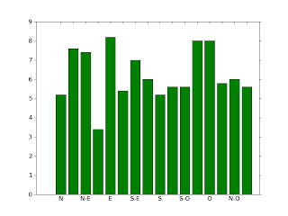

windrose
========

A windrose, also known as a polar rose plot, is a special diagram for representing the distribution of meteorological datas, typically wind speeds by class and direction.
This is a simple module for the matplotlib python library, which requires numpy for internal computation.

Original code forked from:
 - http://youarealegend.blogspot.fr/search/label/windrose

Requirements:
-------------

 - matplotlib http://matplotlib.org/
 - numpy http://www.numpy.org/
 - and naturally python https://www.python.org/ :-P

Example :
---------

Expecting the `windrose.py` file and all the necessary modules are in the `PYTHONPATH`, this example use randoms values for wind speed and direction(ws and wd variables). In situation, these variables are loaded with reals values (1-D array), from a database or directly from a text file (see the "load" facility from the matplotlib.pylab interface for that).

    from windrose import WindroseAxes
    from matplotlib import pyplot as plt
    import matplotlib.cm as cm
    from numpy.random import random
    from numpy import arange

    #Create wind speed and direction variables

    ws = random(500)*6
    wd = random(500)*360

    #A quick way to create new windrose axes...

    def new_axes():
        fig = plt.figure(figsize=(8, 8), dpi=80, facecolor='w', edgecolor='w')
        rect = [0.1, 0.1, 0.8, 0.8]
        ax = WindroseAxes(fig, rect, axisbg='w')
        fig.add_axes(ax)
        return ax

    #...and adjust the legend box

    def set_legend(ax):
        l = ax.legend(axespad=-0.10)
        plt.setp(l.get_texts(), fontsize=8)

A stacked histogram with normed (displayed in percent) results :
----------------------------------------------------------------

    ax = new_axes()
    ax.bar(wd, ws, normed=True, opening=0.8, edgecolor='white')
    set_legend(ax)

Another stacked histogram representation, not normed, with bins limits
----------------------------------------------------------------------

    ax = new_axes()
    ax.box(wd, ws, bins=arange(0,8,1))
    set_legend(ax)

A windrose in filled representation, with a controled colormap
--------------------------------------------------------------

    ax = new_axes()
    ax.contourf(wd, ws, bins=arange(0,8,1), cmap=cm.hot)
    set_legend(ax)

Same as above, but with contours over each filled region...
-----------------------------------------------------------

    ax = new_axes()
    ax.contourf(wd, ws, bins=arange(0,8,1), cmap=cm.hot)
    ax.contour(wd, ws, bins=arange(0,8,1), colors='black')
    set_legend(ax)

...or without filled regions
----------------------------

    ax = new_axes()
    ax.contour(wd, ws, bins=arange(0,8,1), cmap=cm.hot, lw=3)
    set_legend(ax)

After that, you can have a look at the computed values used to plot the windrose with the `ax._info` dictionnary :
 - `ax._info['bins']` : list of bins (limits) used for wind speeds. If not set in the call, bins will be set to 6 parts between wind speed min and max.
 - `ax._info['dir']` : list of directions "bundaries" used to compute the distribution by wind direction sector. This can be set by the nsector parameter (see below).
 - `ax._info['table']` : the resulting table of the computation. It's a 2D histogram, where each line represents a wind speed class, and each column represents a wind direction class.

So, to know the frequency of each wind direction, for all wind speeds, do:

    ax.bar(wd, ws, normed=True, nsector=16)
    table = ax._info['table']
    wd_freq = np.sum(table, axis=0)

and to have a graphical representation of this result :

    dir = ax._info['dir']
    wd_freq = np.sum(table, axis=0)
    plt.bar(arange(16), wd_freq, align='center')
    xlabels = ('N','','N-E','','E','','S-E','','S','','S-O','','O','','N-O','')
    xticks=arange(16)
    gca().set_xticks(xticks)
    draw()
    gca().set_xticklabels(xlabels)
    draw()

In addition of all the standard pyplot parameters, you can pass special parameters to control the windrose production. For the stacked histogram windrose, calling help(ax.bar) will give :
`bar(self, dir, var, **kwargs)` method of `windrose.WindroseAxes` instance Plot a windrose in bar mode. For each var bins and for each sector, a colored bar will be draw on the axes.
 

Mandatory:
 - `dir` : 1D array - directions the wind blows from, North centred
 - `var` : 1D array - values of the variable to compute. Typically the wind speeds

Optional:
 - `nsector` : integer - number of sectors used to compute the windrose table. If not set, nsectors=16, then each sector will be 360/16=22.5°, and the resulting computed table will be aligned with the cardinals points.
 - `bins` : 1D array or integer- number of bins, or a sequence of bins variable. If not set, bins=6 between min(var) and max(var).
 - `blowto` : bool. If True, the windrose will be pi rotated, to show where the wind blow to (usefull for pollutant rose).
 - `colors` : string or tuple - one string color (`'k'` or `'black'`), in this case all bins will be plotted in this color; a tuple of matplotlib color args (string, float, rgb, etc), different levels will be plotted in different colors in the order specified.
 - `cmap` : a cm Colormap instance from `matplotlib.cm`.
   - if `cmap == None` and `colors == None`, a default Colormap is used.
 - `edgecolor` : string - The string color each edge bar will be plotted.
   Default : no edgecolor
 - opening : float - between 0.0 and 1.0, to control the space between each sector (1.0 for no space)
