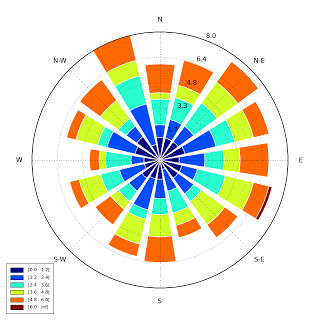
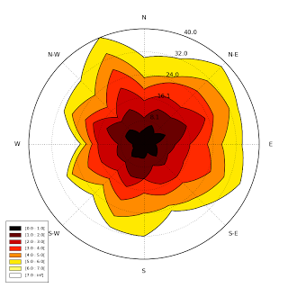

# Summary

A [wind rose](https://en.wikipedia.org/wiki/Wind_rose) is a graphic tool used by meteorologists to give a succinct view of how wind speed and direction are typically distributed at a particular location.

A wind rose can also be used to describe visually air quality.

Windrose is Python Matplotlib, Numpy library to manage wind data, draw windrose 
(also known as a polar rose plot), draw probability density function and fit Weibull distribution

-
-
-

# List of contributors and/or notable users
* Lionel Roubeyrie - LIMAIR - https://github.com/LionelR
* Sébastien Celles - Université de Poitiers - IUT de Poitiers - https://github.com/scls19fr
* Julian Quick - https://github.com/kilojoules
* Ivan Ogasawara - https://github.com/xmnlab
* Samuël Weber - https://github.com/weber-s
* Bruno Ruas De Pinho - https://github.com/brunorpinho
* Fabien Maussion - Research Centre for Climate at the University of Innsbruck - https://github.com/fmaussion
* Filipe Fernandes - School of Marine Science and Technology - https://github.com/ocefpaf
* Daniel Garver - United States Environmental Protection Agency - https://www.epa.gov/
* Ryan Brown - United States Environmental Protection Agency - https://www.epa.gov/

# References
* Travis E, Oliphant. A guide to NumPy, USA: Trelgol Publishing, (2006).
* R.E. Munn (1969) Pollution wind‐rose analysis, Atmosphere, 7:3, 97-105
* "NRCS National Water and Climate Center - Climate Products - Climate Data - Wind Rose." NRCS National Water and Climate Center | Home, www.wcc.nrcs.usda.gov/climate/windrose.html.
* Air Quality Data Analysis using Open Source Tools http://slideplayer.com/slide/5922455/
